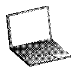

 # &nbsp;&nbsp;Hi there!

 My name is Nicolas. I'm a soon-to-be CS graduate interested in applying state-of-the-art research to practical, impactful applications. I have a strong interest in AI, IoT, and full-stack development, with a passion for building real-world tools and exploring new tech stacks. 
 
 I've worked with frameworks like SwiftUI, SpringBoot, React, Express.js, and Electron, and have also worked with IoT frameworks like STM32Cube w/ MQTT. Other tools I often use are MongoDB, Postman, Appium and Selenium.  My main programming languages are TypeScript, Swift, and Python, though I also have solid experience with C, C++ and Java.

Currently working part time in med-tech as a SW Automation Engineer (until AI do us part). The other half of my day goes into studying and building tools or apps to share with my circle. 
This README serves as a temporary showcase for a few of my achievements and projects while I finish building my portfolio, since many are currently offline.

- SwiftUI iOS application that utilizes AI to identify dog breeds and other complex characteristics, helping track and locate lost dogs by creating a space for users to share sightings and information about lost pets. - Awarded 1st Place: *"Project Innovates on the Edges of Technology"* 
**AIML Internal Nano Hackathon - Apple (2023)**
- iOS app that connects vulnerable communities with safe, formal jobs by linking them with local businesses, using AI to match candidates with job requirements and providing a platform for skill development and community engagement - Awarded National 1st Place 
**National Swift Change Makers - Enactus & Apple (2024):**
- Developed an AI pipeline using custom trained computer vision models and font-specific OCR for an Automatic License Plate Recognition (ALPR) system, designed to monitor border crossing times and traffic patterns. The project focused on facilitating urban deployment and emphasized real time data processing and analysis. 
**Independent Project (2025)** 

